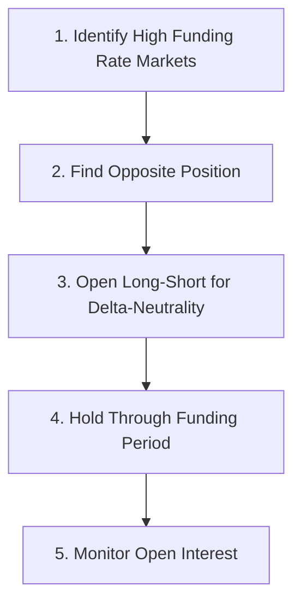

# Funding Rate Arbitrage and Perp Basis Strategies

## 1. Core Mechanism

Crypto perpetual swaps stay near spot via funding payments:

- Positive funding: longs pay shorts.
- Negative funding: shorts pay longs.

Arbitrage exists when funding > total cost of the hedge.

Positive carry = (funding income) - (hedge cost) - (fees + slippage).

---

### 1.1 Empirical Validation (ScienceDirect 2025)

**Study:** "Exploring Risk and Return Profiles of Funding Rate Arbitrage on CEX and DEX" (Werapuna et al., Aug 2025)

| Metric | Finding |
|--------|---------|
| **Assets** | BTC, ETH, XRP, BNB, SOL |
| **Venues** | Binance, Bitmex (CEX) + ApolloX, Drift (DEX) |
| **6-month max return** | 115.9% |
| **Max drawdown** | 1.92% |
| **Correlation with HODL** | **Zero** — true diversification |
| **Leverage impact** | Nuanced, non-monotonic; optimal leverage exists |

Key insight: Funding rate arbitrage provides a stable, uncorrelated return stream suitable for portfolio diversification.

## 3. Execution Frameworks

### 3.1 Amberdata 5-Step Framework (2024)

| Step | Action | Key Consideration |
|------|--------|-------------------|
| **1** | Scan for stark rate contrasts | Real-time funding rate data feeds |
| **2** | Identify contrary positions | Positions opposite prevailing bias |
| **3** | Open corresponding long/short | **Delta-neutrality** buffers price shifts |
| **4** | Maintain through funding intervals | Duration matters — collect/disperse fees |
| **5** | Monitor Open Interest (OI) | High OI = robust market; Low OI = risk |

> **Critical:** Automation is mandatory — manual execution cannot compete at 8-hour funding intervals.

### 3.2 Base Templates

#### 3.2.1 Cross-Exchange Funding Rate Arbitrage

Exploit funding-rate dispersion across venues by holding offsetting positions on two or more exchanges.

- Identify high positive funding venues vs low/negative funding venues.
- Long the cheap-to-fund asset; short the expensive-to-fund asset.
- Maintain delta neutrality with opposite legs across exchanges.
- Capture the spread between funding rates after fees, borrowing, and slippage.
- Prioritize contracts with high open interest to reduce instability and manipulation risk.
- **Include DEX venues (ApolloX, Drift, Hyperliquid) — they exhibit different rate dynamics vs CEX.**

Practical filters:
- Prioritize highest open interest among similar rate spreads.
- Use real-time funding feeds; avoid stale rate windows.
- Hold through full funding intervals to collect payment.
- **Monitor funding rate *predictions* (mark price vs index price), not just realized rates.**

Risk notes:
- Liquidity gaps can widen basis unexpectedly.
- Exchange outages, withdrawal freezes, regulatory changes can strand one leg.
- Funding floor/ceiling rules and index-price deviations can flip sign during volatility.
- **During stress, funding rates across venues converge — arbitrage vanishes.**

### 2.2 Spot-and-Carry

Long spot on a borrow-available exchange. Short perp on a different venue.

- Choose pairs with highest positive funding.
- Size by spot depth and perp depth (min of both).
- Rebalance when spot-perp basis or hedge exposure breaches limit.

### 2.2 Cross-Venue Funding Dispersion

Scan multiple venues for outlier funding rates vs peer median.

- Simple filter: funding rate > median + threshold.
- Execution: open opposite carry where funding is negative.
- Risk: latency means opportunity closes quickly; automate via API or websocket feed.

### 2.3 Basket Basis Trade

Use an index or futures contract to hedge a funding-rate portfolio across multiple assets.

- Reduces single-asset drift.
- Introduces basis risk between spot basket and index.

## 3. Execution Checklist

1. Determine next funding countdown and compounding frequency per venue.
2. Confirm borrow rate and availability for spot asset.
3. Measure orderbook depth at 1% and 5% levels.
4. Compute profitability threshold before opening.
5. Place hedge only after opening primary position.
6. Monitor:
   - funding rate trend
   - borrow utilization
   - orderbook depth
   - open interest change

## 4. Risk Controls

- Cap exposure per venue.
- Hedge drift after basis moves more than configured delta threshold.
- Stop if borrow rate suddenly exceeds funding.
- Separate profit target and liquidation buffer.
- **Track leverage efficiency — diminishing/negative returns beyond optimal leverage (per 2025 empirical study).**
- **Monitor correlation regime changes — funding rates converge during market stress (arbitrage vanishes).**

### 4.1 Regime-Aware Risk Management (Kroniq Regime Radar)

The 2026 Kroniq Regime Radar (Polavarapu, SSRN 6539358) provides a production-ready Gaussian HMM for real-time cross-asset regime detection. Key actionable insights for funding-rate arbitrage:

- **5-state regime model** (Low-Vol, Bull, Neutral, Macro, Crisis) with strong persistence (73–96%)
- **Credit spreads (HY) are the leading indicator** — Macro stress detected 141 days before COVID crash; equity/vol features alone only gave 23 days
- **No direct calm→crisis transitions** — monitor State 4 (Macro) as gatekeeper; when HY spreads widen and VIX elevates, reduce arb exposure pre-emptively
- **Walk-forward OOS (2021–2024):** Sharpe 0.881 vs 0.859 buy-and-hold, max DD -17.5% vs -25%
- **Integration:** Use regime posterior probabilities → continuous risk budget scaling (not binary on/off)

> **Practical rule:** When Kroniq classifies State 4 (Macro) or State 5 (Crisis), scale down funding-rate arb positions by 50–75%; the convergence of funding rates across venues during stress systematically eliminates the arb.

**Related skill:** `finance-strategies/cross-asset-macro-liquidity-signals` — full methodology, feature engineering, and production notes.

## 5. Data Requirements (Institutional Grade)

| Data Type | Purpose | Source |
|-----------|---------|--------|
| Real-time funding rates | Identify opportunities | Exchange APIs / Amberdata |
| Open Interest | Assess market robustness | Exchange APIs |
| Multi-exchange coverage | Cross-venue arbitrage | Aggregated feeds |
| Order book depth | Liquidity risk assessment | L2/L3 data |
| Historical data | Backtesting | Enterprise archives |
| Funding rate predictions | Pre-funding opportunity scan | Mark price vs index feeds |

## 6. Metrics and Reporting

Track per-trade and rolling:

- annualized funding capture
- realized PnL vs expected carry
- hedge-adjusted net delta
- fee drag as % of notional
- missed opportunity count

## 7. Pitfalls

- Annualizing hourly rates without compounding assumptions.
- Ignoring withdrawal restrictions affecting spot liquidation.
- Using stale funding values during volatility.
- Treating basis convergence as guaranteed; it can reverse.
- **Manual execution at 8-hour intervals — automation is non-optional.**
- **Assuming leverage always helps — optimal leverage exists (2025 study).**
- **Ignoring correlation regime shifts — funding rates converge across venues during stress, eliminating arb.**

---

### References

- Amberdata Blog: "The Ultimate Guide to Funding Rate Arbitrage" (Mar 2024)
- ScienceDirect: "Exploring Risk and Return Profiles of Funding Rate Arbitrage on CEX and DEX" (Werapuna et al., Aug 2025) — DOI: 10.1016/j.bcra.2025.100354
